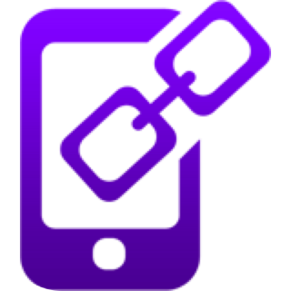

# Ionic +4 DeepLinks & Social Sharing App



![version][version-badge] ![Idioma][idioma] ![status][status-emprogresso]

## Aplicativo desenvolvido para testar o funcionamento e uso dos plugins [Deeplinks](https://ionicframework.com/docs/native/deeplinks) e [Social Sharing](https://ionicframework.com/docs/native/social-sharing).

### Compartilhe o link de um item ou produto usando o aplicativo e depois clique no link e abra o seu aplicativo (launch) na página especificada pelo link com o item ou produto desejado.

Neste tempelate você será capaz de capturar qualquer código no formato de string passado por parâmetro para o seu aplicativo e abrir o app na página desejada.

### $ Ionic info:
```javascript
Ionic CLI                       5.4.14
Ionic Framework @ionic/angular  4.11.8
Cordova CLI (cordova-lib@9.0.1) 9.0.0
Cordova Platforms android       8.1.0
Android SDK Tools               26.1.1
ios-deploy                      1.9.4 
NodeJS                          12.11.1
npm                             6.11.3 
```

### Para rodar este aplicativo é necessário
#### Clonar o repositório
```javascript
git clone https://github.com/TomCosta/deeplinks.git
``` 
Entrar na pasta do app, cd `deeplinks`.
Dar o comando `npm install` e `ionic serve` para instalar as dependências e rodar no navegador em tempo real, veja em `http://localhost:8100/`. Ao fazer qualquer mudança no código o app automaticamente fará um reload, mostrando as novas alterações.

```bash
$ npm install
$ ionic serve
```

### Apenas se for necessário, por algum motivo não previsto. Adicionar os plugins deeplinks e social share.

```bash
$ cordova plugin add ionic-plugin-deeplinks
--variable URL_SCHEME=myapp --variable DEEPLINK_SCHEME=https --variable DEEPLINK_HOST=example.com
--variable ANDROID_PATH_PREFIX=/

$ npm install @ionic-native/deeplinks@latest --save

$ ionic cordova plugin add cordova-plugin-x-socialsharing
$ npm install @ionic-native/social-sharing
```
### ------------------------------------------------------------------

### Below follows the example to use this code to build this app, if you already have the Ionic installed in your environment.

## How to start to use this template
#### Clone the repo
```javascript
git clone https://github.com/TomCosta/deeplinks.git
``` 
#### After clone the repo do:

```bash
$ npm install
```

Then, to run it, cd into `deeplinks` and run:
Run `ionic serve` for a local dev server. Navigate to `http://localhost:8100/`. The app will automatically reload if you change any of the source files.

```bash
$ ionic serve
```

To add the desired platform

```bash
$ ionic cordova platform add ios
$ ionic cordova run ios
```
Substitute ios for android, if you are not on a Mac system.

### If you are starting the environment from zero, install the Ionic and Cordova:

Use command below:

```bash
$ sudo npm install -g ionic cordova
```

# Extras
## Code scaffolding
### Run 
```javascript
ionic generate component `component-name` to generate a new component
```
### You can also use:
```javascript
ionic generate `directive|pipe|service|class|guard|interface|enum|module`
```

####
_By Tom Costa_

[CHANGELOG]: ./CHANGELOG.md
[version-badge]: https://img.shields.io/badge/version-1.0.0-blue.svg
[license-badge]: https://img.shields.io/badge/license-MIT-blue.svg
[status-emprogresso]: https://img.shields.io/badge/status-Em%20progresso-blueviolet
[idioma]: https://img.shields.io/badge/idioma-Portugu%C3%AAs-800060